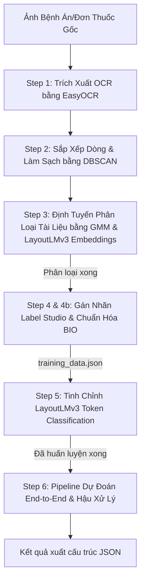

# Hệ Thống Trích Xuất Thông Tin Bệnh Án Y Tế Tự Động (Vietnamese Medical Document AI)
### Mô Hình Kết Hợp: EasyOCR + DBSCAN + GMM Document Routing + LayoutLMv3 (BIO Tagging)

Dự án này là một pipeline xử lý tài liệu thông minh (Document AI) hoàn chỉnh, được thiết kế chuyên biệt để phân loại và trích xuất thông tin thực thể y tế (Patient Name, Diagnosis, Medication, Dosage, Lab Value...) từ các hình ảnh bệnh án, đơn thuốc và phiếu xét nghiệm tiếng Việt.

---

## 📌 Tổng Quan Hệ Thống (Architecture Workflow)

Quy trình xử lý của hệ thống trải qua 6 bước chính từ ảnh gốc cho tới dữ liệu trích xuất cấu trúc cuối cùng:



---

## 📥 Hướng Dẫn Clone & Chạy Nhanh (Quick Start)

Nếu bạn muốn tải dự án này về máy cá nhân của mình để chạy hoặc nghiên cứu tiếp, hãy làm theo các bước chuẩn sau:

### 1. Clone dự án từ GitHub
Mở terminal trên máy và chạy lệnh sau:
```bash
git clone https://github.com/HoangDuyet2005/NCKH_2026_LAYOUTLM_DBCSCAN_GMM.git
cd NCKH_2026_LAYOUTLM_DBCSCAN_GMM
```

### 2. Thiết lập môi trường ảo (Khuyến khích)
Để tránh làm rác thư viện hệ thống, hãy tạo và kích hoạt môi trường ảo:
*   **Trên Windows (PowerShell):**
    ```powershell
    python -m venv venv
    .\venv\Scripts\Activate.ps1
    ```
*   **Trên Linux/macOS:**
    ```bash
    python3 -m venv venv
    source venv/bin/activate
    ```

### 3. Cài đặt các thư viện cần thiết
```bash
# Cài đặt PyTorch với hỗ trợ GPU CUDA (Khuyên dùng để train nhanh)
pip install torch torchvision --index-url https://download.pytorch.org/whl/cu118

# Cài đặt toàn bộ thư viện từ requirements.txt
pip install -r requirements.txt
```

### 4. Chuẩn bị tập dữ liệu (Dataset)
Vì dữ liệu hình ảnh nặng không được đẩy lên GitHub (do cấu hình `.gitignore`), bạn cần tự tạo cấu trúc thư mục và đặt các ảnh của bạn vào:
1.  Tạo thư mục tên `dataset/` ở thư mục gốc của dự án.
2.  Bên trong `dataset/`, tạo 3 thư mục con tương ứng: `Don_thuoc`, `Phieu_xet_nghiem`, `Ho_so_benh_an`.
3.  Bỏ các ảnh y tế tương ứng của bạn vào các thư mục con này để bắt đầu chạy từ `src/step1_ocr_extract.py`.

### 5. Chạy nhanh trích xuất trên ảnh có sẵn (Inference)
Nếu bạn đã có mô hình đã được huấn luyện nằm ở thư mục `layoutlmv3-medical-finetuned/`, chỉ cần bỏ ảnh cần trích xuất (ví dụ `test.png`) vào thư mục `assets/`, thay đổi biến `TEST_IMAGE_PATH` ở cuối file `src/step6_inference_postprocessing.py` và chạy:
```bash
python src/step6_inference_postprocessing.py
```

---

## 🛠️ Yêu Cầu Hệ Thống & Cài Đặt (Setup & Installation)

Dự án yêu cầu cài đặt Python 3.10 trở lên và cài đặt các thư viện trên môi trường có hỗ trợ **GPU CUDA** để đạt hiệu suất tối ưu khi chạy mô hình học sâu.

### 1. Cài đặt các thư viện cốt lõi
Chạy lệnh sau bằng Python hệ thống để cài đặt toàn bộ các thư viện cần thiết:
```powershell
pip install torch torchvision --index-url https://download.pytorch.org/whl/cu118
pip install -r requirements.txt
```

### 2. Cấu trúc thư mục dự án
```text
NCKH_Model/
├── src/                                 # Toàn bộ mã nguồn Python
│   ├── step1_ocr_extract.py             # Trích xuất OCR tiếng Việt bằng EasyOCR
│   ├── step2_dbscan_cleaning.py         # Làm sạch nhiễu và sắp xếp dòng bằng DBSCAN
│   ├── step3_gmm_routing.py             # Định tuyến loại tài liệu bằng GMM & LayoutLMv3 [CLS]
│   ├── step4_prepare_label_studio.py    # Tạo dữ liệu định dạng Label Studio
│   ├── step4b_label_studio_to_training.py # Ánh xạ nhãn gán thành cấu trúc BIO
│   ├── step5_layoutlmv3_finetune.py     # Huấn luyện (Fine-tune) mô hình LayoutLMv3
│   ├── step6_inference_postprocessing.py # Pipeline dự đoán ảnh mới & Hậu xử lý trích xuất
│   ├── check_export.py                  # Kiểm tra file export Label Studio
│   ├── cors_server.py                   # HTTP Server hỗ trợ CORS cho Label Studio
│   └── plot_metrics.py                  # Vẽ biểu đồ kết quả huấn luyện
├── data/                                # Dữ liệu JSON nhãn
│   ├── label_studio_export.json         # File nhãn xuất ra từ Label Studio
│   ├── label_studio_import.json         # File nhãn chuẩn bị để import vào Label Studio
│   └── training_data.json               # File dữ liệu chuẩn hóa dạng BIO để training
├── assets/                              # Ảnh minh họa / demo
│   └── training_progress.png            # Biểu đồ đánh giá kết quả huấn luyện mô hình
├── dataset/                             # [.gitignore] Tập dữ liệu ảnh gốc chia 3 loại
│   ├── Don_thuoc/
│   ├── Phieu_xet_nghiem/
│   └── Ho_so_benh_an/
├── layoutlmv3-medical-finetuned/        # [.gitignore] Mô hình LayoutLMv3 đã finetune
├── .gitignore
├── requirements.txt
└── README.md
```

---

## 🚀 Hướng Dẫn Vận Hành Chi Tiết (Step-by-Step Guide)

> **Lưu ý:** Tất cả các lệnh đều chạy từ thư mục gốc (root) của dự án.

### Bước 1: Trích xuất OCR bằng EasyOCR
Mô hình sẽ quét thư mục `dataset`, nhận diện chữ tiếng Việt và tọa độ Bounding Box, sau đó lưu thành các file `.json` đi kèm cùng cấp với mỗi ảnh.
```powershell
python src/step1_ocr_extract.py
```

### Bước 2: Sắp xếp dòng & Làm sạch bằng DBSCAN
Do tọa độ OCR của EasyOCR thường bị xô lệch và trả về dạng các từ đơn lẻ, thuật toán **DBSCAN** sẽ gom cụm các từ trên cùng một dòng vật lý và sắp xếp chúng từ trái sang phải, đồng thời loại bỏ các điểm nhiễu ngoại lai.
```powershell
python src/step2_dbscan_cleaning.py
```

### Bước 3: Định tuyến phân loại tài liệu (GMM + LayoutLMv3 Embeddings)
Sử dụng mô hình LayoutLMv3 pretrained để trích xuất Page-level Embedding (vector `[CLS]`), sau đó dùng thuật toán phân cụm hỗn hợp Gaussian (**Gaussian Mixture Model - GMM**) để tự động phân loại tài liệu thành 3 nhóm chính: Đơn thuốc, Phiếu xét nghiệm, Hồ sơ bệnh án.
```powershell
python src/step3_gmm_routing.py
```

### Bước 4: Chuẩn bị dữ liệu và Gán nhãn thủ công (Label Studio)
Tạo file nhập liệu cho Label Studio đã được điền sẵn kết quả OCR sạch:
```powershell
python src/step4_prepare_label_studio.py
```
*   **Hướng dẫn gán nhãn:** Import file `data/label_studio_import.json` vào công cụ [Label Studio](http://localhost:8080). Tiến hành quét vùng và gán nhãn thực thể y tế theo 5 nhóm nhãn đích: `Patient_Name`, `Diagnosis`, `Medication`, `Dosage`, `Lab_Value`. Sau đó export kết quả định dạng JSON lưu vào dự án với tên **`data/label_studio_export.json`**.

### Bước 4b: Chuyển đổi dữ liệu nhãn thành cấu trúc BIO
Ánh xạ tọa độ gán nhãn thủ công từ phần trăm sang hệ tọa độ pixel của OCR, chuẩn hóa về khoảng `[0, 1000]` và gán nhãn định dạng BIO (B-Entity, I-Entity, O) cho từng từ:
```powershell
python src/step4b_label_studio_to_training.py
```

### Bước 5: Huấn luyện (Fine-tune) LayoutLMv3
Huấn luyện mô hình Transformer đa phương thức (Multimodal) kết hợp thông tin văn bản, bố cục không gian (Bounding Box) và hình ảnh gốc của tài liệu:
```powershell
python src/step5_layoutlmv3_finetune.py
```

### Bước 6: Chạy thử nghiệm dự đoán End-to-End & Hậu xử lý trích xuất
Quét một ảnh đơn thuốc/bệnh án mới, chạy qua toàn bộ pipeline tự động (OCR -> DBSCAN -> GMM -> LayoutLMv3). Thuật toán hậu xử lý heuristics sẽ ghép các từ đơn lẻ có nhãn BIO liền kề nhau thành cụm từ hoàn chỉnh và xuất ra file kết quả JSON cấu trúc:
```powershell
python src/step6_inference_postprocessing.py
```

---

## 🖼️ Minh Họa Dữ Liệu & Kết Quả Huấn Luyện (Demo & Training Progress)

### 1. Dữ Liệu Mẫu Bệnh Án & Phiếu Xét Nghiệm
| Đơn Thuốc Mẫu | Phiếu Xét Nghiệm Mẫu |
|:---:|:---:|
|  |  |

### 2. Biểu Đồ Đánh Giá Quá Trình Huấn Luyện (Training & Validation Curves)


---

## 📊 Kết Quả Huấn Luyện Mô Hình (Evaluation Metrics)

Hệ thống đã được huấn luyện tối ưu qua 1000 bước (111 Epochs) trên tập dữ liệu gán nhãn thực tế. Kết quả đánh giá trên tập kiểm tra độc lập qua các mốc huấn luyện như sau:

| Step | Epoch | Eval Loss | Precision (%) | Recall (%) | F1-Score (%) | Accuracy (%) |
|:---:|:---:|:---:|:---:|:---:|:---:|:---:|
| 100 | 11.11 | 0.2784 | 96.30 | 38.81 | 55.32 | 93.85 |
| 200 | 22.22 | 0.2221 | 67.74 | 62.69 | 65.12 | 95.25 |
| 300 | 33.33 | 0.2407 | 68.85 | 62.69 | 65.63 | 94.97 |
| 400 | 44.44 | 0.2443 | 71.43 | 67.16 | 69.23 | 95.25 |
| **500 (Best)** | **55.56** | **0.2499** | **77.59** | **67.16** | **72.00** | **95.81** |
| 600 | 66.67 | 0.2793 | 70.77 | 68.66 | 69.70 | 95.25 |
| 700 | 77.78 | 0.2787 | 71.93 | 61.19 | 66.13 | 95.53 |
| 800 | 88.89 | 0.2820 | 75.00 | 67.16 | 70.87 | 95.53 |
| 900 | 100.00 | 0.2953 | 74.58 | 65.67 | 69.84 | 95.81 |
| 1000 | 111.11 | 0.3016 | 73.68 | 62.69 | 67.74 | 95.81 |

*   **Chỉ số tối ưu nhất:** Đạt được ở **Step 500** với điểm **F1-Score đạt 72.00%** (Precision: **77.59%**, Recall: **67.16%**, Accuracy: **95.81%**).
*   Mô hình ở bước tốt nhất (Step 500) đã tự động được trích xuất và đóng gói làm trọng số dự đoán chính của pipeline tại `./layoutlmv3-medical-finetuned`.
*   Biểu đồ chi tiết đường cong học tập (Learning Curves) được lưu trữ tại file ảnh **`assets/training_progress.png`** trong thư mục assets.

Để vẽ lại biểu đồ hoặc cập nhật bảng thông số mới khi huấn luyện lại, hãy chạy:
```powershell
python src/plot_metrics.py
```

---
*Bản quyền nghiên cứu khoa học thuộc về nhóm tác giả dự án NCKH 2026 - HoangDuyet2005.*
