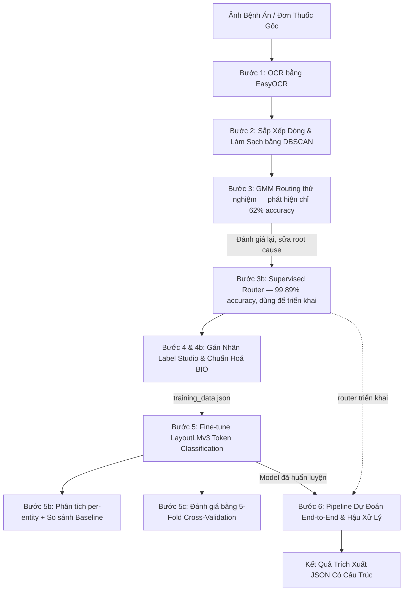
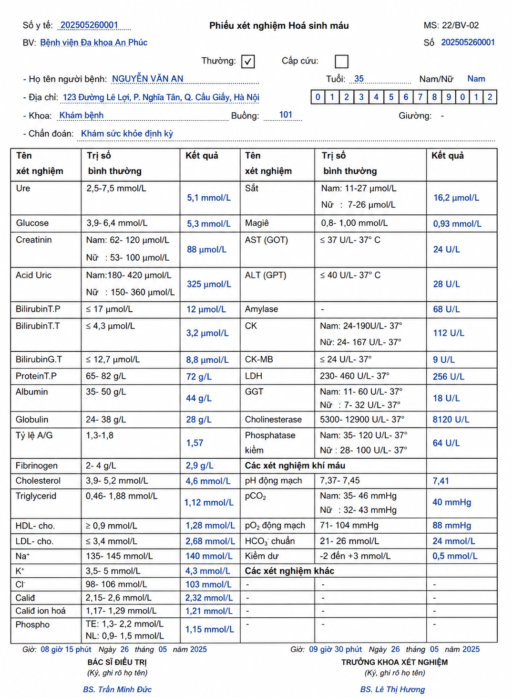
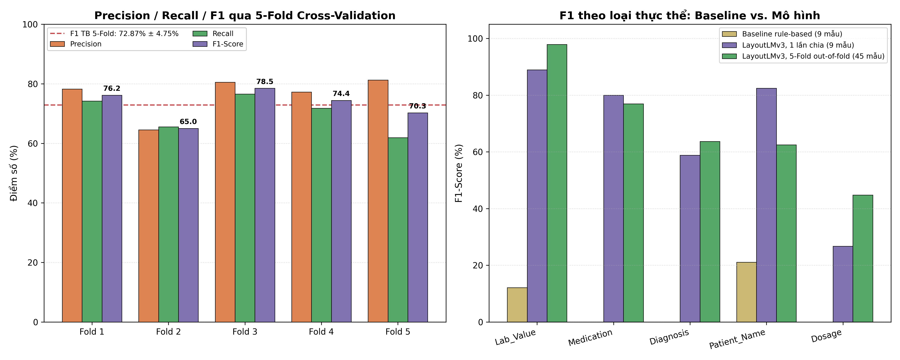
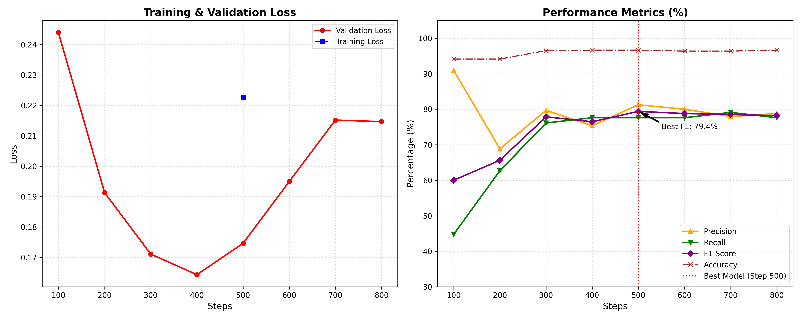

# Hệ Thống Trích Xuất Thông Tin Bệnh Án Y Tế Tự Động
### Vietnamese Medical Document AI — EasyOCR + DBSCAN + GMM Routing + LayoutLMv3 (BIO Tagging)

Pipeline Document AI hoàn chỉnh, chuyên biệt cho việc **phân loại và trích xuất thông tin thực thể y tế** (Tên bệnh nhân, Chẩn đoán, Tên thuốc, Liều lượng, Kết quả xét nghiệm) từ ảnh chụp bệnh án, đơn thuốc và phiếu xét nghiệm **tiếng Việt** — đi từ ảnh gốc, qua OCR và định tuyến phân loại tài liệu, tới một mô hình Transformer đa phương thức được fine-tune và đánh giá bằng cross-validation.

> Dự án ban đầu thử định tuyến tài liệu bằng GMM không giám sát (đúng như tên repo) — sau khi đánh giá đúng cách, phát hiện cách này chỉ đạt ~62% accuracy nên đã thay bằng supervised classifier, đạt 99.89%. Toàn bộ hành trình này (thử → phát hiện lỗi → sửa) được giữ nguyên trong repo, xem mục [Bước 3 & 3b](#-hướng-dẫn-vận-hành-chi-tiết-step-by-step-guide) và [Hạn Chế](#-hạn-chế--định-hướng-cải-thiện).

---

## Mục Lục

- [Tổng Quan Hệ Thống](#-tổng-quan-hệ-thống-architecture-workflow)
- [Quick Start](#-quick-start)
- [Cấu Trúc Dự Án](#-cấu-trúc-dự-án)
- [Hướng Dẫn Vận Hành Chi Tiết](#-hướng-dẫn-vận-hành-chi-tiết-step-by-step-guide)
- [Minh Hoạ Dữ Liệu](#-minh-hoạ-dữ-liệu)
- [Kết Quả Đánh Giá](#-kết-quả-đánh-giá-evaluation-results)
- [Hạn Chế & Định Hướng Cải Thiện](#-hạn-chế--định-hướng-cải-thiện)

---

## 📌 Tổng Quan Hệ Thống (Architecture Workflow)

Quy trình xử lý trải qua 6 bước chính từ ảnh gốc tới dữ liệu trích xuất cấu trúc cuối cùng, cộng thêm 2 bước đánh giá sâu (5b, 5c) chạy song song với Bước 5 để kiểm chứng độ tin cậy của mô hình:



**Điểm nổi bật về mặt kỹ thuật:**
- **Document Routing — hành trình sửa lỗi thật**: thử GMM không giám sát trước, đánh giá đúng cách (train/test hold-out, tránh data leakage) phát hiện GMM chỉ đạt ~62% accuracy và thất bại hoàn toàn với 1 loại tài liệu; chẩn đoán nguyên nhân (embedding chưa fine-tune + lãng phí nhãn thật đã có sẵn) → chuyển sang Logistic Regression có giám sát trên embedding đã fine-tune, xác nhận **99.89% ± 0.22% accuracy** qua 5-Fold CV. Xem mục "Bước 3b" bên dưới.
- **LayoutLMv3 Token Classification**: fine-tune mô hình Transformer đa phương thức (text + layout + hình ảnh) để gán nhãn BIO cho 5 loại thực thể y tế.
- **Đánh giá bằng 5-Fold Cross-Validation**: không chỉ báo cáo 1 con số F1 trên 1 lần chia dữ liệu — mô hình được đánh giá out-of-fold trên toàn bộ tập gán nhãn để có kết luận thống kê đáng tin cậy hơn (chi tiết ở mục [Kết Quả Đánh Giá](#-kết-quả-đánh-giá-evaluation-results)).
- **So sánh với baseline rule-based**: định lượng mức độ hữu ích thực sự của việc fine-tune một mô hình đa phương thức so với một cách tiếp cận regex/keyword đơn giản.

---

## 📥 Quick Start

### 1. Clone dự án
```bash
git clone https://github.com/HoangDuyet2005/NCKH_2026_LAYOUTLM_DBCSCAN_GMM.git
cd NCKH_2026_LAYOUTLM_DBCSCAN_GMM
```

### 2. Thiết lập môi trường ảo (khuyến khích)
*   **Windows (PowerShell):**
    ```powershell
    python -m venv venv
    .\venv\Scripts\Activate.ps1
    ```
*   **Linux / macOS:**
    ```bash
    python3 -m venv venv
    source venv/bin/activate
    ```

### 3. Cài đặt thư viện
```bash
# PyTorch với hỗ trợ GPU CUDA (khuyến khích để train nhanh)
pip install torch torchvision --index-url https://download.pytorch.org/whl/cu118

# Toàn bộ thư viện còn lại
pip install -r requirements.txt
```
Yêu cầu **Python 3.10+**. Khuyến khích chạy trên máy có **GPU CUDA** — mô hình đã được huấn luyện và benchmark thực tế trên GPU laptop 6GB VRAM (xem ghi chú tốc độ ở Bước 5c).

### 4. Chuẩn bị dữ liệu
Dữ liệu ảnh gốc không được đẩy lên GitHub (`.gitignore`). Tự tạo cấu trúc:
```
dataset/
├── Don_thuoc/
├── Phieu_xet_nghiem/
└── Ho_so_benh_an/
```
rồi đặt ảnh y tế tương ứng vào từng thư mục con để bắt đầu chạy từ `src/step1_ocr_extract.py`.

### 5. Chạy nhanh trích xuất trên ảnh có sẵn (Inference)
Nếu đã có model fine-tune tại `layoutlmv3-medical-finetuned/`, chỉ cần đặt ảnh cần trích xuất vào `assets/`, đổi biến `TEST_IMAGE_PATH` ở cuối `src/step6_inference_postprocessing.py`, rồi chạy:
```bash
python src/step6_inference_postprocessing.py
```

---

## 📁 Cấu Trúc Dự Án

```text
NCKH_Model/
├── src/
│   ├── step1_ocr_extract.py              # Trích xuất OCR tiếng Việt bằng EasyOCR
│   ├── step2_dbscan_cleaning.py          # Làm sạch nhiễu & sắp xếp dòng bằng DBSCAN
│   ├── step3_gmm_routing.py              # [Thử nghiệm] Định tuyến bằng GMM -- chỉ 62% accuracy, xem step3b
│   ├── step3b_supervised_routing.py      # Định tuyến bằng Logistic Regression -- 99.89% accuracy, dùng triển khai
│   ├── step4_prepare_label_studio.py     # Tạo dữ liệu định dạng Label Studio
│   ├── step4b_label_studio_to_training.py# Ánh xạ nhãn gán thành cấu trúc BIO
│   ├── step5_layoutlmv3_finetune.py      # Fine-tune LayoutLMv3 (huấn luyện chính thức)
│   ├── step5b_eval_breakdown.py          # Đánh giá chi tiết theo loại thực thể + baseline rule-based
│   ├── step5c_kfold_cv.py                # Đánh giá bằng 5-Fold Cross-Validation
│   ├── step6_inference_postprocessing.py # Pipeline dự đoán ảnh mới & hậu xử lý trích xuất
│   ├── check_export.py                   # Kiểm tra file export Label Studio
│   ├── cors_server.py                    # HTTP server hỗ trợ CORS cho Label Studio
│   ├── plot_metrics.py                   # Vẽ biểu đồ huấn luyện (Bước 5, 1 lần chia)
│   └── plot_kfold_results.py             # Vẽ biểu đồ kết quả 5-Fold CV
├── data/
│   ├── label_studio_export.json          # Nhãn xuất ra từ Label Studio
│   ├── label_studio_import.json          # Nhãn chuẩn bị để import vào Label Studio
│   ├── training_data.json                # Dữ liệu chuẩn hoá dạng BIO để training
│   └── kfold_results.json                # Kết quả tổng hợp 5-Fold Cross-Validation
├── assets/
│   ├── training_progress.png             # Biểu đồ huấn luyện Bước 5 (1 lần chia)
│   └── kfold_results.png                 # Biểu đồ kết quả 5-Fold CV
├── dataset/                              # [.gitignore] Ảnh gốc, chia 3 loại tài liệu
│   ├── Don_thuoc/
│   ├── Phieu_xet_nghiem/
│   └── Ho_so_benh_an/
├── layoutlmv3-medical-finetuned/         # [.gitignore] Model LayoutLMv3 đã fine-tune
├── .gitignore
├── requirements.txt
└── README.md
```

---

## 🚀 Hướng Dẫn Vận Hành Chi Tiết (Step-by-Step Guide)

> Tất cả lệnh chạy từ thư mục gốc (root) của dự án.

### Bước 1 — OCR bằng EasyOCR
Quét thư mục `dataset`, nhận diện chữ tiếng Việt và bounding box, lưu kết quả thành file `.json` cùng cấp mỗi ảnh.
```powershell
python src/step1_ocr_extract.py
```

### Bước 2 — Sắp xếp dòng & làm sạch bằng DBSCAN
Tọa độ OCR của EasyOCR thường xô lệch và trả về dạng từ đơn lẻ; **DBSCAN** gom cụm các từ trên cùng dòng vật lý, sắp xếp trái sang phải, loại bỏ điểm nhiễu ngoại lai.
```powershell
python src/step2_dbscan_cleaning.py
```

### Bước 3 — Định tuyến phân loại tài liệu (GMM, thử nghiệm ban đầu)
Trích xuất page-level embedding `[CLS]` từ LayoutLMv3 pretrained, dùng **Gaussian Mixture Model** (không giám sát) để tự động phân loại tài liệu thành 3 nhóm (Đơn thuốc / Phiếu xét nghiệm / Hồ sơ bệnh án).

Đánh giá được tách bạch để tránh data leakage: GMM fit và ánh xạ cluster→nhãn **chỉ trên tập train (80%)**, `classification_report` đo **trên tập test hold-out (20%)** mà mô hình chưa từng thấy.
```powershell
python src/step3_gmm_routing.py
```

> ⚠️ Sau khi sửa leakage, số liệu trung thực cho thấy GMM chỉ đạt **~62% accuracy**, thất bại hoàn toàn khi phân biệt `Phiếu xét nghiệm` với `Hồ sơ bệnh án`. Đây là lý do Bước 3b ra đời — xem ngay bên dưới. Bước 3 (GMM) được giữ lại trong repo như minh hoạ kỹ thuật phân cụm không giám sát và làm bài học cụ thể về tầm quan trọng của việc đánh giá đúng cách, **không dùng để triển khai thực tế**.

### Bước 3b — Định tuyến phân loại tài liệu (Supervised Classifier, dùng để triển khai)
GMM ở Bước 3 bộc lộ 2 vấn đề khi đánh giá trung thực: (1) dùng embedding từ model **pretrained gốc**, chưa đủ đặc trưng phân biệt 2 loại tài liệu có bố cục bảng biểu giống nhau; (2) **nhãn thật đã có sẵn** (tên thư mục trong `dataset/`) nhưng lại dùng phương pháp không giám sát — lãng phí thông tin. Bước 3b khắc phục cả 2: dùng embedding từ model **đã fine-tune** (đồng bộ đúng với những gì Bước 6 dùng lúc dự đoán thật) + **Logistic Regression có giám sát**.

```powershell
python src/step3b_supervised_routing.py
```

Kết quả xác nhận bằng 5-Fold CV out-of-fold trên toàn bộ 904 ảnh: **99.89% ± 0.22% accuracy** (so với ~62% của GMM cũ). Router này (`document_router.pkl`) là router chính thức được `step6_inference_postprocessing.py` sử dụng để triển khai.

### Bước 4 — Chuẩn bị dữ liệu & gán nhãn thủ công (Label Studio)
```powershell
python src/step4_prepare_label_studio.py
```
Import `data/label_studio_import.json` vào [Label Studio](http://localhost:8080), gán nhãn theo 5 nhóm thực thể đích: `Patient_Name`, `Diagnosis`, `Medication`, `Dosage`, `Lab_Value`. Export kết quả về `data/label_studio_export.json`.

### Bước 4b — Chuyển đổi nhãn thành cấu trúc BIO
Ánh xạ tọa độ nhãn thủ công (phần trăm) sang hệ tọa độ pixel OCR, chuẩn hoá về `[0, 1000]`, gán nhãn BIO (B-/I-/O) cho từng từ.
```powershell
python src/step4b_label_studio_to_training.py
```

### Bước 5 — Fine-tune LayoutLMv3
Huấn luyện mô hình Transformer đa phương thức, kết hợp văn bản, bố cục không gian (bounding box) và ảnh gốc.
```powershell
python src/step5_layoutlmv3_finetune.py
```

### Bước 5b (tuỳ chọn) — Phân tích chi tiết & so sánh Baseline
Đánh giá lại model đã fine-tune, tách theo từng loại thực thể, so với baseline rule-based (regex/keyword) trên cùng tập test — định lượng mức độ hữu ích thực sự của việc fine-tune.
```powershell
python src/step5b_eval_breakdown.py
```

### Bước 5c (tuỳ chọn) — Đánh giá bằng 5-Fold Cross-Validation
Chia 45 mẫu gán nhãn thành 5 fold, mỗi mẫu được dùng làm test đúng 1 lần bởi model chưa từng thấy nó lúc train, rồi gộp kết quả trên toàn bộ dữ liệu — đáng tin cậy hơn nhiều so với 1 lần chia 9 mẫu.
```powershell
python src/step5c_kfold_cv.py
python src/plot_kfold_results.py   # vẽ lại biểu đồ sau khi có kết quả mới
```
**Cần GPU, mất khoảng 5-7 tiếng** (huấn luyện 5 model độc lập — đo thực tế trên GPU laptop RTX 3050 6GB). Script tự dọn checkpoint sau mỗi fold để tránh làm đầy ổ đĩa; nên có sẵn ít nhất ~5GB trống trước khi chạy.

### Bước 6 — Pipeline dự đoán End-to-End & hậu xử lý
Chạy toàn bộ pipeline tự động (OCR → DBSCAN → Document Routing [Bước 3b] → LayoutLMv3) trên 1 ảnh mới. Hậu xử lý heuristic ghép các từ có nhãn BIO liền kề thành cụm từ hoàn chỉnh, xuất kết quả JSON có cấu trúc.
```powershell
python src/step6_inference_postprocessing.py
```

---

## 🖼️ Minh Hoạ Dữ Liệu

| Đơn Thuốc Mẫu | Phiếu Xét Nghiệm Mẫu |
|:---:|:---:|
|  |  |

---

## 📊 Kết Quả Đánh Giá (Evaluation Results)

### 1. Đánh giá chính: 5-Fold Cross-Validation

Vì tập gán nhãn chỉ có **45 tài liệu**, một lần chia train/test cố định (36/9) không đủ tin cậy — chỉ 1-2 thực thể dự đoán sai đã làm F1 dao động vài điểm phần trăm. Thay vì gán thêm nhãn (tốn nhiều thời gian), mô hình được đánh giá bằng **5-Fold Cross-Validation**: chia lại 45 mẫu thành 5 fold, mỗi mẫu lần lượt làm test đúng 1 lần bởi model chưa từng thấy nó lúc train (out-of-fold), rồi gộp toàn bộ dự đoán lại để đánh giá trên **toàn bộ 45 tài liệu / 387 thực thể**.



| Chỉ số | Trung bình 5 fold | F1 out-of-fold (toàn bộ 45 mẫu) |
|:---|:---:|:---:|
| Precision | 76.35% ± 6.10% | 76.5% |
| Recall | 70.00% ± 5.46% | 70.8% |
| **F1-Score** | **72.87% ± 4.75%** | **73.6%** |

**F1 theo từng loại thực thể** (so với baseline rule-based và với con số đo trên 1 lần chia ban đầu):

| Loại thực thể | Baseline rule-based | LayoutLMv3, 1 lần chia (9 mẫu) | LayoutLMv3, **5-Fold out-of-fold (45 mẫu)** | Support (OOF) |
|:---|:---:|:---:|:---:|:---:|
| Lab_Value | 12.1% | 100.0% | **97.9%** | 145 |
| Medication | 0.0% | 80.0% | **76.9%** | 38 |
| Diagnosis | 0.0% | 66.7% | **63.7%** | 74 |
| Patient_Name | 21.1% | 70.0% | **62.5%** | 48 |
| Dosage | 0.0% | 30.8% | **44.8%** | 82 |
| **Micro avg (tổng)** | **11.3%** | **79.4%** | **73.6%** | 387 |

**Nhận định:**
*   F1 trung bình 5 fold (72.87%) và F1 out-of-fold (73.6%) đều gần với con số 79.4% của lần chia đơn (checkpoint triển khai chính thức) nhưng **thấp hơn khoảng 6-7 điểm** — đây chính là bằng chứng cụ thể cho lý do phải dùng K-Fold CV thay vì tin vào 1 lần chia: dù dùng đúng config đã regularize, 1 lần chia 9 mẫu vẫn có thể "may mắn" hơn ước lượng trung bình thật sự trên toàn bộ dữ liệu. **Con số 72.87% (± 4.75%) / 73.6% out-of-fold mới là ước lượng đáng tin cậy về khả năng tổng quát hoá thật của mô hình**, không phải 79.4%.
*   Mô hình vượt baseline rule-based rõ rệt trên mọi loại thực thể (73.6% vs 11.3% F1 tổng, đo out-of-fold) — việc fine-tune một mô hình đa phương thức thực sự cần thiết so với cách tiếp cận rule-based.
*   So sánh cột "1 lần chia" và "out-of-fold" tiếp tục cho thấy vì sao nên nghi ngờ số liệu đo trên tập nhỏ: `Patient_Name` trông khá tốt (70.0%) khi chỉ đo trên 10 thực thể, nhưng rơi xuống 62.5% khi đo trên 48 thực thể (out-of-fold). Ngược lại `Dosage` trông tệ hơn thực tế (30.8%, support 5) so với con số đo trên nhiều thực thể hơn (44.8%, support 82).
*   **`Dosage` là loại thực thể yếu nhất một cách nhất quán ở mọi cách đo** — hướng cải thiện cụ thể, đáng ưu tiên nhất khi có thêm dữ liệu gán nhãn.

### 2. Quá trình huấn luyện chính thức (Bước 5, 1 lần chia)

Model triển khai (`layoutlmv3-medical-finetuned/`) được chọn theo checkpoint tốt nhất của lần huấn luyện chính thức này (chia cố định 36 train / 9 test, `weight_decay=0.01` + `EarlyStoppingCallback`):



| Step | Epoch | Eval Loss | Precision (%) | Recall (%) | F1-Score (%) | Accuracy (%) |
|:---:|:---:|:---:|:---:|:---:|:---:|:---:|
| 100 | 11.11 | 0.2439 | 90.91 | 44.78 | 60.00 | 94.13 |
| 200 | 22.22 | 0.1913 | 68.85 | 62.69 | 65.63 | 94.13 |
| 300 | 33.33 | 0.1711 | 79.69 | 76.12 | 77.86 | 96.51 |
| 400 | 44.44 | 0.1643 | 75.36 | 77.61 | 76.47 | 96.65 |
| **500 (Best)** | **55.56** | **0.1746** | **81.25** | **77.61** | **79.39** | **96.65** |
| 600 | 66.67 | 0.1949 | 80.00 | 77.61 | 78.79 | 96.37 |
| 700 | 77.78 | 0.2152 | 77.94 | 79.10 | 78.52 | 96.37 |
| 800 | 88.89 | 0.2147 | 78.79 | 77.61 | 78.20 | 96.65 |

Checkpoint tốt nhất (Step 500, F1 **79.39%**) được tự động trích xuất làm trọng số triển khai. `EarlyStoppingCallback` dừng huấn luyện ở Step 800 (3 lần eval liên tiếp không cải thiện F1 so với Step 500) thay vì chạy hết 1000 bước như cấu hình tối đa — tiết kiệm compute và tránh overfitting thêm. So với lần chạy gốc chưa có regularization (F1 tốt nhất 72.00%, eval loss tăng dần không kiểm soát tới 0.30 ở step 1000), lần chạy này có eval loss được kiểm soát tốt hơn nhiều (đỉnh chỉ ~0.215) và F1 cao hơn hẳn — **nhưng lưu ý con số 79.39% này là kết quả của 1 lần chia dữ liệu**, xem mục 5-Fold CV ở trên để có ước lượng đáng tin cậy hơn về khả năng tổng quát hoá thật (72.87% ± 4.75%).

Chạy lại đánh giá / vẽ lại biểu đồ:
```powershell
python src/plot_metrics.py        # biểu đồ Bước 5 (1 lần chia)
python src/plot_kfold_results.py  # biểu đồ 5-Fold CV
```

---

## ⚠️ Hạn Chế & Định Hướng Cải Thiện

**Đã khắc phục trong quá trình phát triển:**
- **GMM Router (Bước 3) từng bị data leakage khi đánh giá** (fit và eval trên cùng dữ liệu) → tách train/test hold-out riêng biệt. Số liệu trung thực sau đó lộ ra 1 vấn đề nghiêm trọng hơn: GMM thực chất chỉ đạt **~62% accuracy**, thất bại hoàn toàn khi phân biệt `Phiếu xét nghiệm` với `Hồ sơ bệnh án` (0% recall). Nguyên nhân: dùng embedding từ model pretrained gốc (chưa fine-tune, lệch pha với embedding thật dùng lúc inference ở Bước 6), và lãng phí nhãn thật đã có sẵn cho 1 phương pháp không giám sát. → **Bước 3b**: chuyển sang Logistic Regression có giám sát trên embedding đã fine-tune, xác nhận **99.89% ± 0.22% accuracy** qua 5-Fold CV — đây là router chính thức dùng để triển khai.
- **Chưa có baseline so sánh** → đã bổ sung baseline rule-based (regex/keyword), định lượng được LayoutLMv3 hơn baseline 73.6% vs 11.3% F1 (xem mục Kết Quả).
- **Dấu hiệu overfitting** (eval loss tăng nhẹ sau Step 500) → đã bổ sung `weight_decay` + `EarlyStoppingCallback`.
- **Chỉ đánh giá trên 1 lần chia 9 mẫu, độ tin cậy thấp** → đã bổ sung 5-Fold Cross-Validation, đánh giá out-of-fold trên toàn bộ 45 mẫu.

**Còn tồn tại:**
1.  **Quy mô dữ liệu gán nhãn NER còn nhỏ.** Mới gán nhãn BIO thủ công cho 45/900+ ảnh trong `dataset/` (15 ảnh/loại). 5-Fold CV xác nhận F1 ~72-74% ổn định qua nhiều lần chia, nhưng đây vẫn là con số đo trên đúng 45 tài liệu sẵn có, chưa kiểm chứng trên dữ liệu độc lập mới. Hướng khắc phục: mở rộng gán nhãn lên hàng trăm ảnh/loại, ưu tiên `Dosage` — loại thực thể yếu nhất nhất quán ở mọi cách đo.
2.  **Chất lượng OCR trên chữ viết tay/con dấu còn nhiễu.** EasyOCR đôi lúc đọc sai nặng trên đoạn chữ viết tay hoặc bị mờ/dấu mộc đè lên. Hướng khắc phục: thử OCR engine chuyên biệt cho chữ viết tay tiếng Việt, hoặc thêm tiền xử lý ảnh (deskew, khử nhiễu, tăng tương phản) trước OCR.
3.  **Baseline rule-based còn đơn giản** (chỉ phủ tốt `Lab_Value`/`Patient_Name`). Có thể nâng cấp thành baseline mạnh hơn (CRF, hoặc NER cổ điển không dùng layout) để đối chứng chặt hơn.
4.  **Chưa có unit test / CI.** Pipeline hiện chạy dưới dạng các script độc lập theo từng bước, chưa có kiểm thử tự động để đảm bảo tính ổn định khi thay đổi code.

---
*Bản quyền nghiên cứu khoa học thuộc về nhóm tác giả dự án NCKH 2026 — HoangDuyet2005.*
